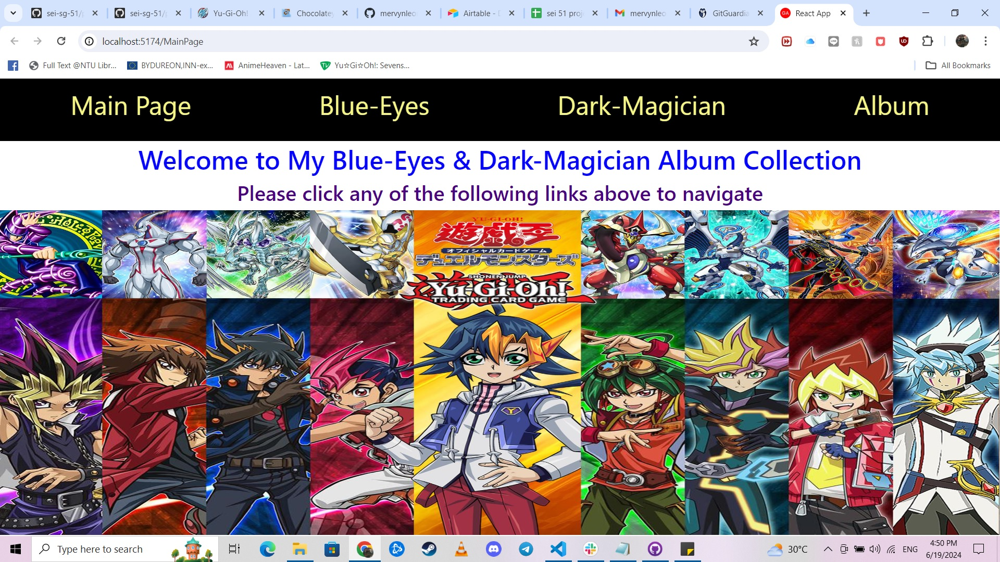
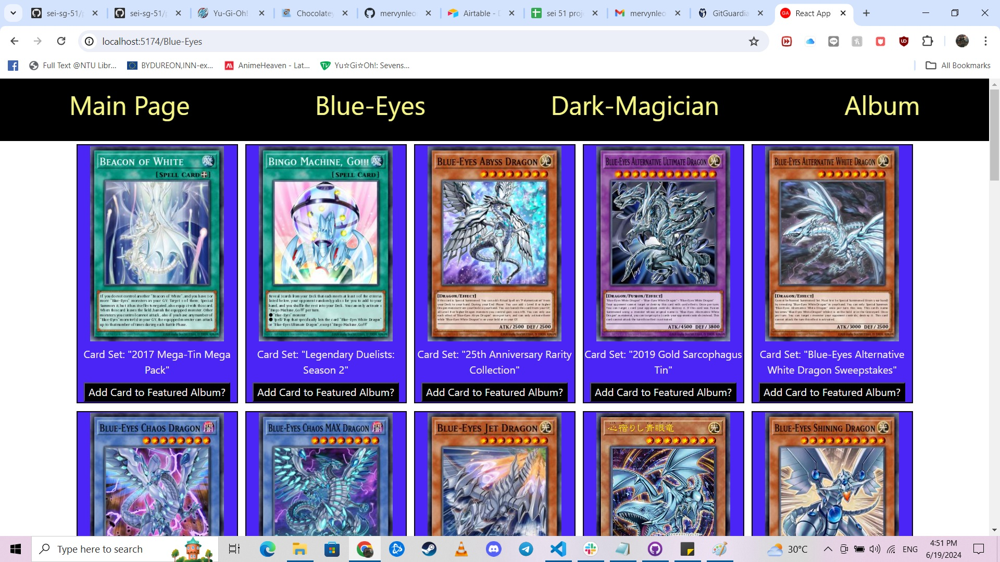
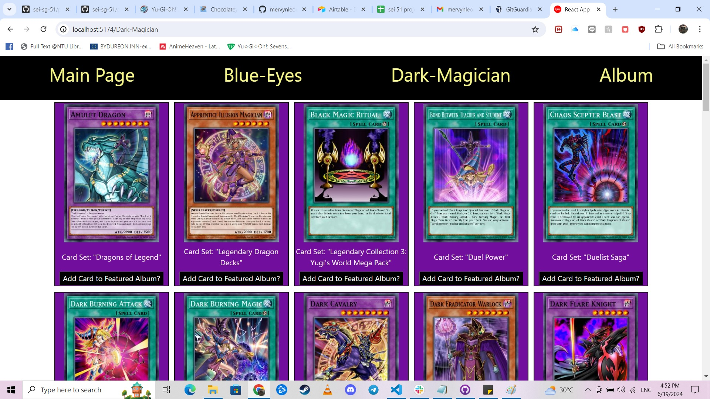
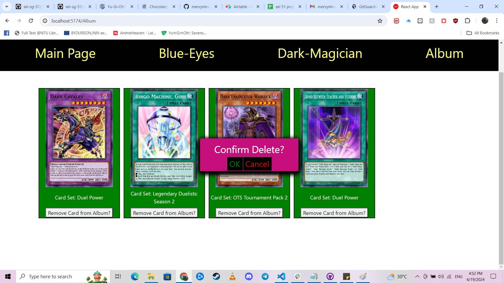
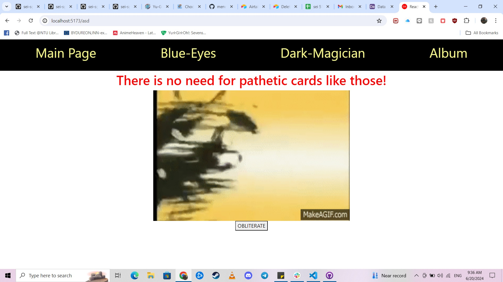

# Yugioh Album App for GA project

App Name: My_BlueEyes_DarkMagician

Link to my Public Board: https://github.com/users/mervynleong/projects/2/views/1

Storyboarding:
I want to create an app "For Old-School Yu-Gi-Oh! Enthusiasts" to "View types of Blue-eyes and Dark-Magician Cards available and favourite them into an album. The album will be saved and allow users to view their favourite cards and which card sets they are from."

The inspiration of this app is from "Yugipedia" Phone application on Android and iOS.
The Yugipedia Phone app is a more extensive app that allows users to view cards and make a deck. Basically establishing a virtual deck builder (Bigger sized album per se).

What the App does:

First off is when the user enters the home landing page it features the screenshot below:

The user can then click on any of the 4 prompts above indicated as:

- Main Page
  This will route the user to the current landing page. If the user is not in the "Main Page".
  There is no feature for the user to interact with this page. It just acts as a home page for the user.

- Blue-Eyes
  This will route the user to the landing page below. It shows all the available "Blue-Eyes" archetype in the Yu-Gi-Oh! card game.
  
  Each and every card (Image) will be shown and they will depict the card_sets available if it is an official released card.
  There will be an option to add card to "Album" to store the images and card sets as a "Favourtied Card". Similarly to an actual album in real life, the user can add multiple copies of the same card and store into the album. (This is not a bug, it is an intentional feature).

- Dark-Magician
  Similar to "Blue-Eyes" landing page above, the "Dark-Magician" landing page will direct the user to a page where it shows all available "Dark-Magician" archetype in the Yu-Gi-Oh! card game as shown below.
  Each and every card will also be shown and can be added to the "Album" as well.
  

- Album
  "Album" is a page where the user can see the cards that the user has selected to be added from "Blue-Eyes", "Dark-Magician" as shown below.
  

The user can also delete the cards that he/she does not want to be in the featured album. There will be a prompt to confirm the deletion of the "card" selected as shown below.
Clicking on "Removed from card Album?" button will trigger the prompt, and clicking on "OK" will validate the deletion process to remove the featured card from the album. Clicking on cancel will remove the prompt and invalidate the deletion process which will technically do "nothing"/ not removing the card from the album.

In addition to the features above, there is an additional conditional feature.
This feature requires the user to type the landing page wrongly. Example ".../Album" leads to the "Album", ".../MainPage" leads to the "Main Page". However, if the endpoint is not keyed in correctly. It will direct the user to the specific landing page below. This specific landing page will "inform" the users that there are no such cards available for viewing. In addition, the button (Obliterate) below the gif in the landing page can be clicked to allow the user to trigger a sound-effect, taking the iconic line from Yu-Gi-Oh!, "Exodia, Obliterate" to be played.

Technologies used:
React.js
HTML
CSS
Airtable

Planned future enhancements: search function to display the cards instead. Maybe a possible "deck builder" like "Yugipedia" app.
I would like to thank GA's Gabrielle and Desmond for their help in debugging and guiding me in this project.

References:
For Yu-Gi-Oh! Gif in NotFound Page:
https://makeagif.com/i/3KnshT

For Yu-Gi-Oh! API for fetching data (this API is constantly updated where even pre-released cards are updated which results in fetching undefined values for card_sets.):
https://ygoprodeck.com/api-guide/

For Yu-Gi-Oh! Wallpaper on Main Page:
https://www.reddit.com/r/yugioh/comments/10xtz0g/yugioh_protagonists_wallpaper_hd/

For Yu-Gi-Oh! Sound in NotFound Page:
https://www.voicy.network/search/yugioh-sound-effects
